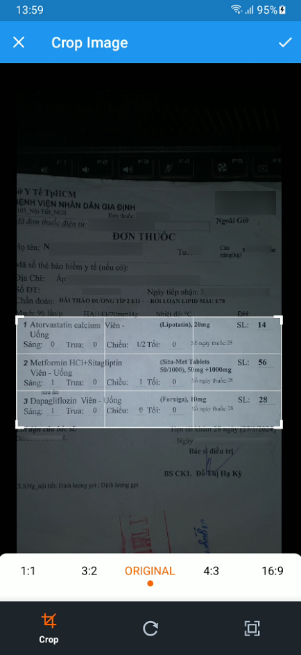

# PillPal - Overview

<a name="top">

  

  
Click to expand

- [Introduction](#introduction)
- [Context](#context)
- [Feature](#feature)
- [Tech Stack](#tech-stack)
- [System Overview](#system-overview)
- [Screen Overview](#screen-overview)
  - [Web Admin/Manager Application](#web-adminmanager-application)
  - [Mobile User Application](#mobile-user-application)
- [Contributors](#contributors)

## Introduction

PillPal is an application that helps users to search for information about drugs and support taking medications as prescribed. The application provides a lot of useful features to help users manage their medications taking effectively, as well as for managers to manage medicines information and users' data.

The application is built with the main following technologies:

- **Flutter** to build up the mobile application
- **ReactJS** to build up the web application
- **.NET** to create RESTful API supporting for both applications
- **SQL Server** and **Redis** as main and cache database respectively

<a href="#top">[back to top]</a>

## Context

  
  
Context Diagram

<a href="#top">[back to top]</a>

## Feature

Web Admin/Manager Application:

- Admin Dashboard
- User Management
- Medicine-related Management
- Support adding Medicine from **Excel** file
- Package Management

Mobile User Application:

- User Authentication
- Search for Medicine Information
- Scan and create Prescription
- Create Medication Intake Schedule
- Integrate third-party payment gateway (ZaloPay)

<a href="#top">[back to top]</a>

## Tech Stack

  
  
  

  
  
  
  

  
  
  
  
  
  

  
  
  
  
  
  
  

  
  
  
  
  
  
  
  

<a href="#top">[back to top]</a>

## System Overview

  
  
System Architecture Design

<a href="#top">[back to top]</a>

## Screen Overview

### Web Admin/Manager Application

  
  
Login Screen

 

  
  
  
Admin Dashboard Screen

 

  
  
  
Medicine Management Screen

### Mobile User Application

  
  
Login/Register Screen

 

  
  
  
  
Medicine Search Screen

 

  
  
  
  
Medicine Prescription Screen

 

  
  
  
  
Medicine Purchase Screen

<a href="#top">[back to top]</a>

## Contributors

The project was supervised by Ms. Truong Thi My Ngoc and was developed by the following members:

- [Nguyen Hoang Chien](https://github.com/Coder-From-VN) - Mobile Developer
- [Nguyen Phan Phuoc Thang](https://github.com/NguyenPhanPhuocThang) - Frontend Developer **[Team Leader]**
- [Nguyen Truong Thanh](https://github.com/tnt-exe) - Backend Developer
- [Vo Trong Dat](https://github.com/Frontier68) - Frontend Developer

<a href="#top">[back to top]</a>

